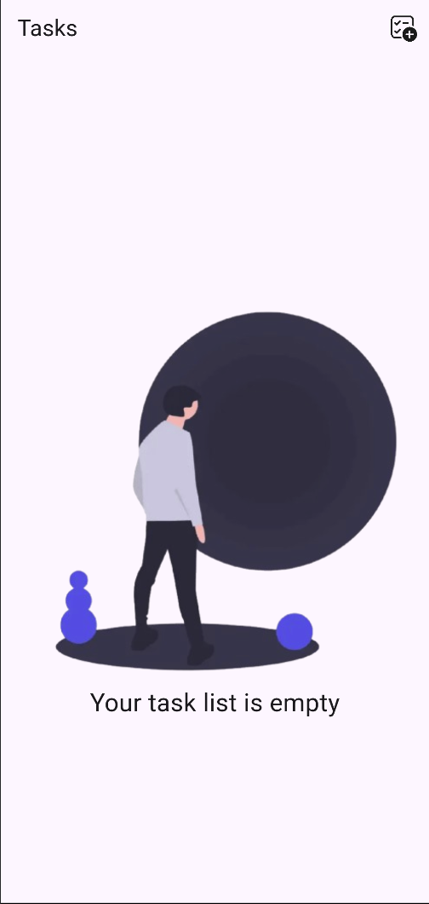
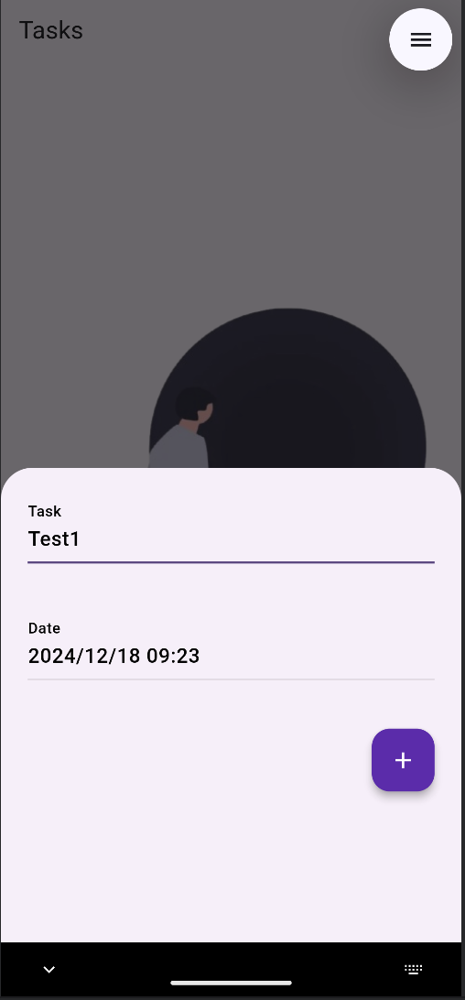
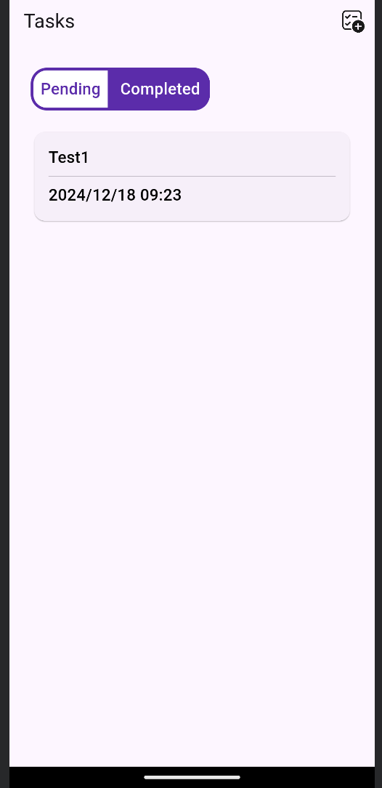
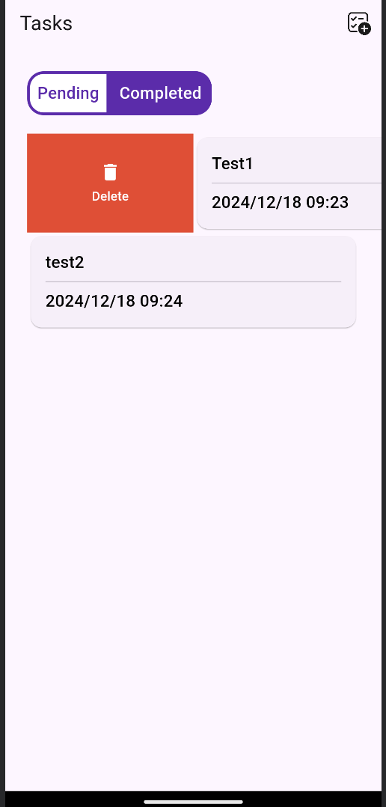
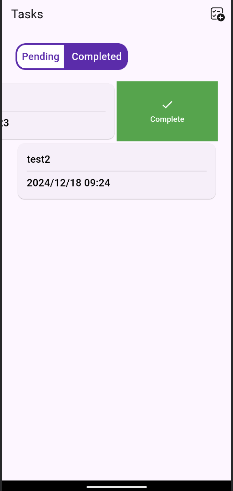
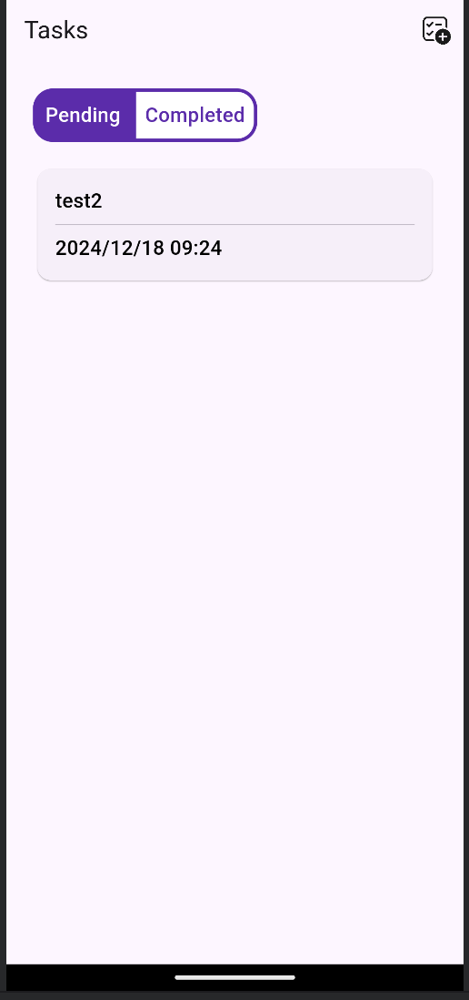

# Android Task Application

This is a Flutter Application to manage a task list. You can add, delete and complete an added task

 
 
 

## Installation
Clone this repository 
```bash
git clone https://github.com/ajidres/TaskFlutter.git
```

## IDE
Import the cloned repo to your preference IDE

## Generating debug APK
In a terminal, locate in the project folder and execute:
1. flutter build apk

## Maintainers
This project is mantained by:
* [Andres Jimenez](https://github.com/ajidre)
